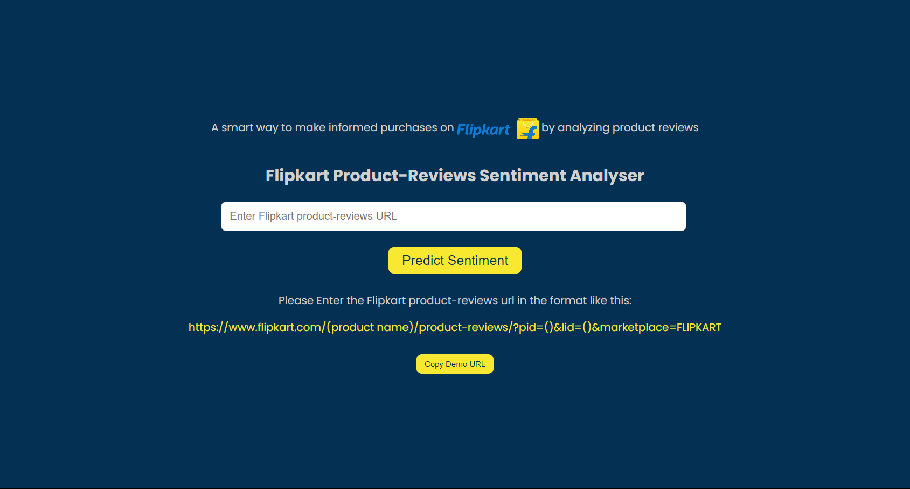
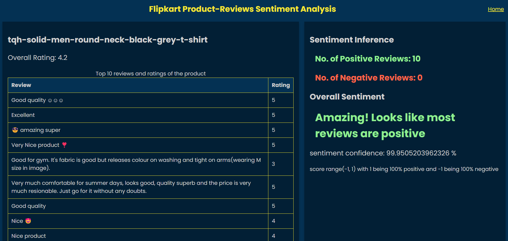
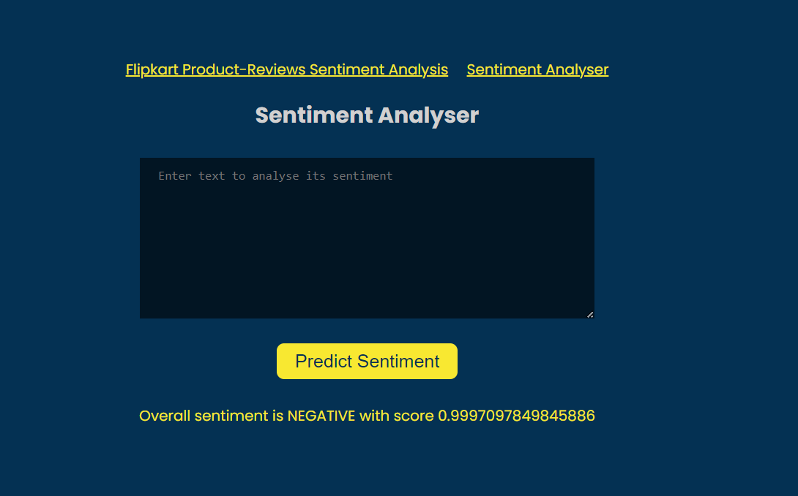
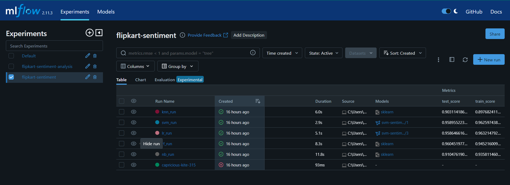

# DecisePrecise

<a href="https://github.com/ishaq88/flipkart-product-reviews-sentiment-analysis/blob/main/MLOps-sentiment-model/MLops%20orchestration.ipynb"> MLOps Notebook </a>

****
<a href="http://65.0.138.126:5050/"> Check out the Website  </a>
****

## This app analyzes the reviews from the flipkart product pages and gives sentiment score.

Tech-Stack : Python, Torch, Huggingface-Transformers , flask

the model is saved locally inside a "model" directory which is needed for sentiment inference Check out <a href="https://huggingface.co/cardiffnlp/twitter-roberta-base-sentiment-latest"> Here </a> to know more about taking inference from pretrained model

*Note: The Flipkart reviews analyser currently only works on local host as when we try to fetch reviews from flipkart it works perfectly fine for local host but gives status code-500 for deployed app*

### screenshots👇🏼

****

****

Entered text: Not as expected....💔Disappointed with the camera and specially performanceDesign and display is quite goodBut very laggy... Frame drops in every application and even with in home page....90hz is not working properly...Recommend not to buy📵UI is very slow and many features are unavailable.... I had so much expectations from Samsung specially but very very dissatisfied....💔

****
##MLOps screenshots

