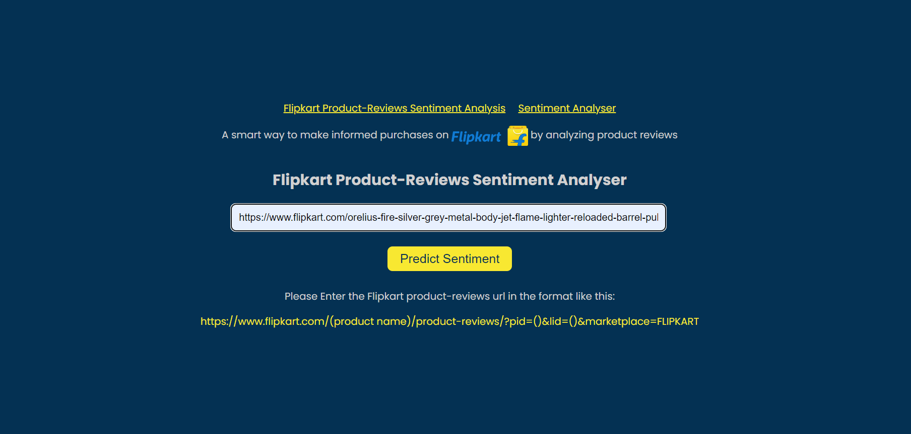

# DecisePrecise

****
<a href="http://65.0.138.126:5050/"> AWS Link </a>
****

## This app analyzes the reviews from the flipkart product pages and gives sentiment score.

Tech-Stack : Python, Torch, Huggingface-Transformers , flask

the model is saved locally inside a "model" directory which is needed for sentiment inference Check out <a href="https://huggingface.co/cardiffnlp/twitter-roberta-base-sentiment-latest"> Here </a> to know more about taking inference from pretrained model

*Note: The Flipkart reviews analyser only works on local host as when we try to fetch reviews from flipkart it gives internal server error but works perfectly fine for local host*

### screenshots👇🏼

****

****

Entered text: Not as expected....💔Disappointed with the camera and specially performanceDesign and display is quite goodBut very laggy... Frame drops in every application and even with in home page....90hz is not working properly...Recommend not to buy📵UI is very slow and many features are unavailable.... I had so much expectations from Samsung specially but very very dissatisfied....💔

